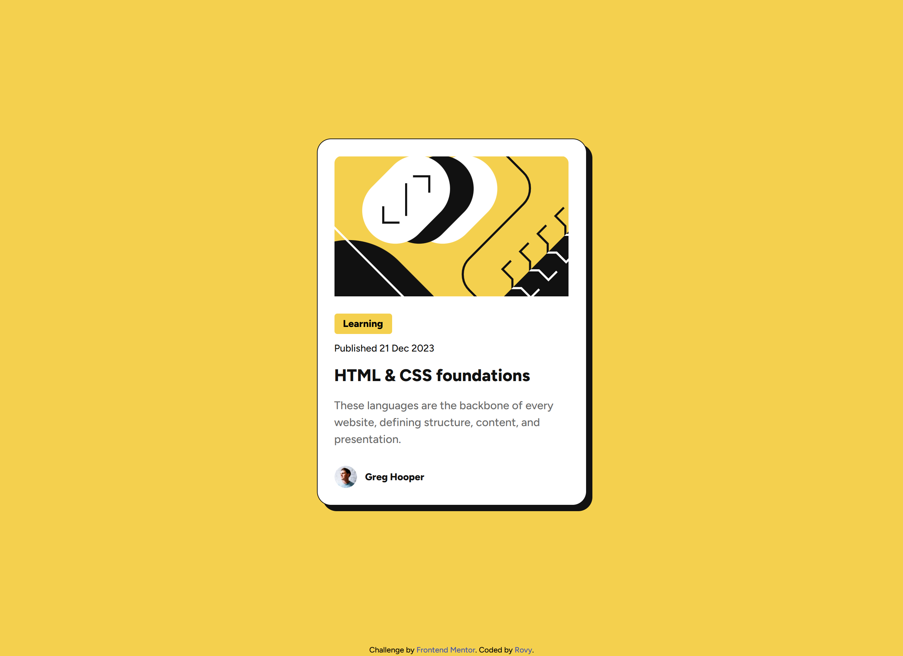

# Frontend Mentor - Blog preview card solution

This is a solution to the [Blog preview card challenge on Frontend Mentor](https://www.frontendmentor.io/challenges/blog-preview-card-ckPaj01IcS). Frontend Mentor challenges help you improve your coding skills by building realistic projects. 

## Table of contents

- [Overview](#overview)
  - [The challenge](#the-challenge)
  - [Screenshot](#screenshot)
  - [Links](#links)
- [My process](#my-process)
  - [Built with](#built-with)
  - [What I learned](#what-i-learned)
  - [Continued development](#continued-development)
  - [Useful resources](#useful-resources)
  - [AI Collaboration](#ai-collaboration)
- [Author](#author)

## Overview

### The challenge

Users should be able to:

- See hover and focus states for all interactive elements on the page

### Screenshot

### Links

- Solution URL: [Github repository](https://github.com/rovyhonolario53-code/blog-preview-card-frontend-mentor)
- Live Site URL: [Add live site URL here](https://rovyhonolario53-code.github.io/blog-preview-card-frontend-mentor/)

## My process

### Built with

- Semantic HTML5 markup
- Flexbox
- Tailwind CSS
- Mobile-first workflow

### What I learned

This project is very similar to the QR code component. I very much learned about Tailwind again. I also noticed that I used arbitrary values frequently in this project. I leaned about the <time> tag as well to make the project semantic.

### Continued development

Use this section to outline areas that you want to continue focusing on in future projects. These could be concepts you're still not completely comfortable with or techniques you found useful that you want to refine and perfect.

### Useful resources

- [Tailwind CSS docs](https://tailwindcss.com/docs) - Helped me with arbitrary values like `w-[288px]` and the `@theme` setup.
- [Figpea](https://figpea.com) - Used the Inspect tab to read font sizes, colors, and spacing from the design file.

### AI Collaboration

Similar to the QR code component, I mainly used claude in the setup process and teach me about Figpea since I struggled on how to navigate in the app.

## Author

- Frontend Mentor - [@Rovy Rain](https://www.frontendmentor.io/profile/rovyhonolario53-code)
- Github - [@rovyhonolario53-code](https://github.com/rovyhonolario53-code)

